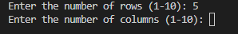
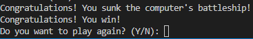
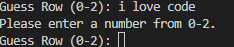
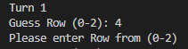
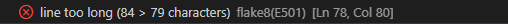
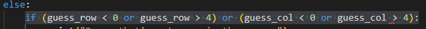
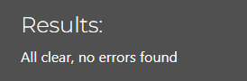

Welcome pphilippersson6,

This is the Code Institute student template for deploying your third portfolio project, the Python command-line project. The last update to this file was: **August 17, 2021**

## Reminders

* Your code must be placed in the `run.py` file
* Your dependencies must be placed in the `requirements.txt` file
* Do not edit any of the other files or your code may not deploy properly

## Creating the Heroku app

When you create the app, you will need to add two buildpacks from the _Settings_ tab. The ordering is as follows:

1. `heroku/python`
2. `heroku/nodejs`

You must then create a _Config Var_ called `PORT`. Set this to `8000`

If you have credentials, such as in the Love Sandwiches project, you must create another _Config Var_ called `CREDS` and paste the JSON into the value field.

Connect your GitHub repository and deploy as normal.

## Constraints

The deployment terminal is set to 80 columns by 24 rows. That means that each line of text needs to be 80 characters or less otherwise it will be wrapped onto a second line.

-----
Happy coding!

# Battleship Game
This is a simple implemention to play the "Battleship Game" using only python.

Try out the game here. 

# Usage

## How to play?

* Run the battleship.py file.
* The player is prompted to enter the number of rows and columns they want to play with (between 1 and 10).
* A game board is created for both the player and the computer.
* The computer randomly places its battleship on its board.
* The game then proceeds to to take turns to guess the location of the other's battleship.
* If a guess hits the other player's battleship, they win the game. Otherwise, the game continues until all ships are sunk.
* After the game is finished, the player can choose to play again or quit, by pressing y or n.

## Game Rules

* Battleship is a two-player guessing game where each player tries to sink the other's hidden ships.
* The game board is a grid of squares, in this game you can play up to 10x10 squares.
* The players ships are randomly generated by the computer. The ships are hidden from the enemy.
* You take turns calling out the column and rows where you think the ship are located (from row, column 0, up to row and column 10).
* If the guess hits the opponent's battleship, it is marked with an "X".
* If the guess misses the opponent's battleship, it is marked with an "O".
* If a player hits all of the squares of a ship, the ship is considered "sunk".
* The first player to sink all of the other player's ships wins the game.

# Layout/Data model
The Battleship Game is a simple game played on a board with a grid of cells. 
The objective of the game is to guess the location of the computer's hidden battleship
and sink it before the computer sinks the player's battleship.
The game board is represented by a 2D list, where each cell can be either "O" (for empty) or 
"X" (for a hit). The game starts with both the player and the computer's board initialized with all "O" cells.

During each turn, the player enters a row and column to guess the location of the computer's battleship.
If the guess matches the location of the battleship, the player wins.
Otherwise, the player's guess is marked as a hit on the board with an "X".

After the player's turn, the computer makes a random guess by selecting a cell on the player's board.
If the guess matches the location of the player's battleship, the computer wins. 
Otherwise, the computer's guess is marked as a hit on the board with an "X".

The game continues until either the player or the computer sinks the other's battleship. 
At the end, the game also provides an option for the player to start a new game once the current game is over.

# Features and Functions

## Features

* Adjust the grid/player board size between 1-10
columns and rows. The player can choose by its own!

* Play versus the computer.
* Two playing-boards. The players and the computers.
* Take turns to guess row and columns.

![Gameboard]readme-assets/step2.png

* When the game is finished, you got two options.
"y" or "n". Type "y" if you want to play again. 
And type "n" if you don't want to play again.

* You cannot input numbers that are above the grid-size.
* You cannot input text. It has to be numbers.
* You cannot enter the same numbers two times.

## Future Improvements

* A implemented scoreboard
* Let the player implement its own ships on the board

## Functions

* `initialize_board(rows, cols)`: Creates and initializes a game board with the specified number of rows and columns.
* `print_boards(player_board, computer_board, computer_guess)`: Prints the current state of both game boards and the computer's guess.
* `play_game()`: Plays the game of Battleship.

# Requirements
* This game requires Python 3.x and the `random` module.

# Testing

# Bugs
I had one problem at the beginning of my coding, and it was that one of my lines were too long.
After some research, i found out very fast how i could break up the code.

# Remaining Bugs

## Validator testing
The python code was tested from a pep8, and no errors could be found! [PEP8 validator](https://pep8ci.herokuapp.com/)

### Content
